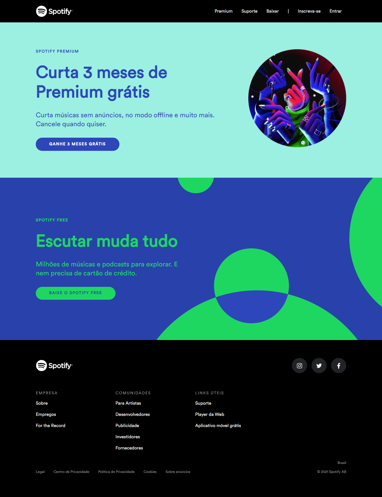

# spotify-site

- Fala galera! 😎

- Apresento a vocês mais um clone de interface, dessa vez foi desenvolvida a página web do Spotify, Brasil.

- Este projeto foi criado utilizando apenas as tecnologias HTML e CSS com SASS

- A página foi hospedada no <a href="https://www.netlify.com/">Netlify</a>, com deploy automático via Git

- Vaaleu!

 

